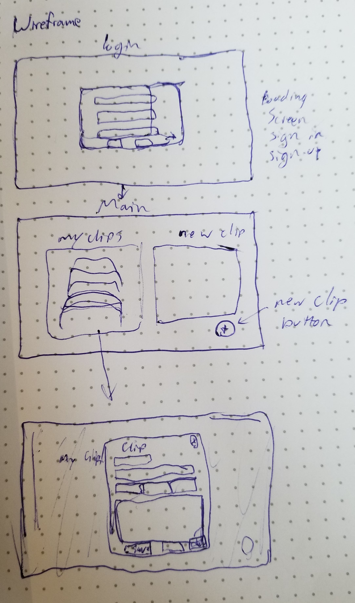

# Resume Clips Client

## About
  Resume Clips is an app for storing and organizing all of the content you might want to include on a resume. Not everyone took a direct path from high school to the field we are currently working in or would like to work in. As such, we often need different resumes for applying to different positions. What is relevant to one company or industry isn't relevant to another. With Reume Clips, you can keep track of ALL your information to easily reference it when you tweak your resume.

  [The deployed frontend of the app](https://nicholaspowel.github.io/resume-clips-client/)

  [The repo for the backend API](https://github.com/nicholaspowel/resume-clips-rails-api)

  [The deployed backend of the app](https://resume-clips-rails-api.herokuapp.com/)

## Features
* Create an account, or sign into an existing one
* Create new resume clips
* Edit existing clips or delete them

## Features in the works
* Organize resume clips into collections
* Filter resume clips by category
* Increase the number types of clip that can be created
* Connect to the LinkedIN api

## Planning

I started by creating user stories and wireframes. With the rough outline from these and a functioning Rails API I was able to systematically go through creating and testing each feature as I would expect to encounter them as a user. Although I kept some eye to code modularity as I went, significant refactoring was required to use Handlebars and implement the Update feature.

### User Stories
As a user:
* I expect to be able to login
* I expect to be able to logout
* I expect to be able to change my password
* I expect to be able to access my clips
* I expect to be able to create new clips
* I expect to be able to modify my resume clips
* I expect to be able to delete clips
* I expect to be able to sign out

### Wireframes

## Technologies Used
* HTML
* CSS
* SASS
* Bootstrap
* JavaScript
* JQuery
* Hnadlebars.js
* Ajax

* * *
*A special shoutout to Jennifer Meade for styling, code, and UX inspiration (and a bit of code for each)*
